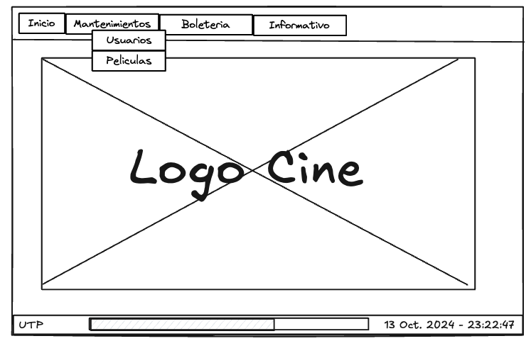

# App Cine - Proyecto UTP

### Requerimientos

1. Mantenimiento de usuarios
   1. Permitir ingresar nuevos usuarios
   2. Permitir modificar usuarios existentes
   3. Permitir eliminar usuarios
   4. Listar todos los usuarios
2. Mantenimiento de peliculas
   1. Permitir ingresar nuevas peliculas
   2. Permitir modificar peliculas existentes
   3. Permitir eliminar peliculas
   4. Listar todas las peliculas
   5. Permitir admintar hasta 3 fotos
   6. Permitir seleccionar generos
   7. Marcar si la pelicula esta permitido para niños
3. Boleteria
   1. Permitir ingresar datos del cliente
   2. Permitir selección de la pelicula
   3. Listar cartelera y seleccionar horario
   4. Mostrar bustacas disponibles
   5. Permitir seleccionar butacas
   6. Simular pagos
4. Autenticación
   1. Permitir ingreso con el usuario creado, las credenciales se autoasignaran

### Wireframes

1. Menu principal

